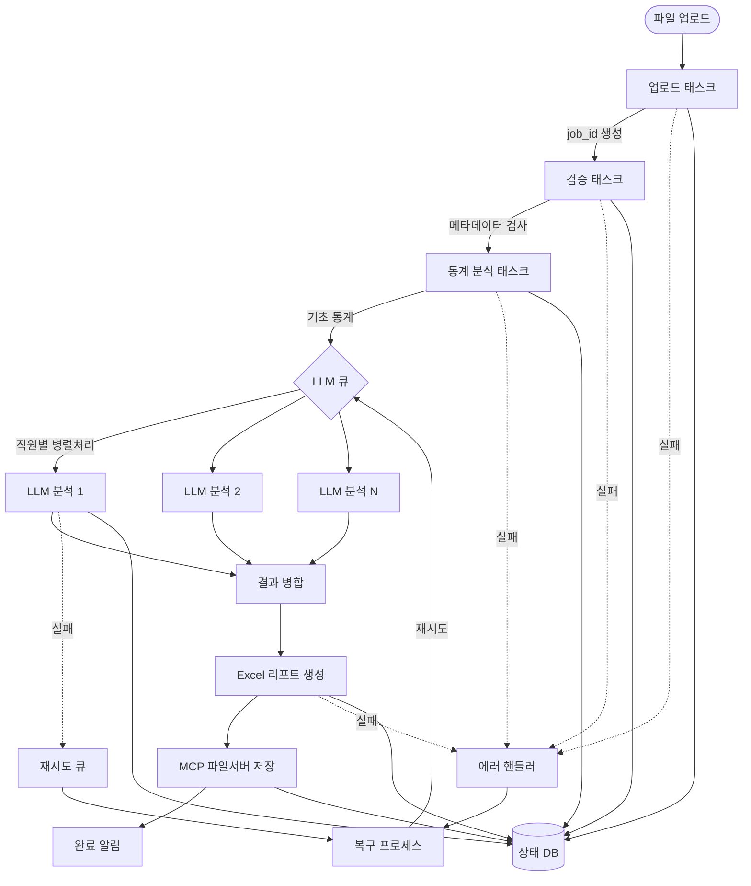

# AIRISS HR 평가데이터 자동화 워크플로우 아키텍처

## 전체 워크플로우 다이어그램



## 핵심 컴포넌트

### 1. ShrimpTaskManager
- 모든 태스크의 생명주기 관리
- 상태 추적 및 복구
- 재시도 로직 구현
- 에러 핸들링

### 2. 워크플로우 엔진
- 태스크 간 의존성 관리
- 병렬/순차 실행 제어
- 중단점 복구
- 진행상황 모니터링

### 3. 상태 관리 시스템
- PostgreSQL 기반 상태 저장
- 각 태스크별 상태 추적
- 실패 지점 복구 정보
- 메타데이터 관리

### 4. LLM 처리 큐
- 병렬 처리를 위한 큐 시스템
- 부하 분산
- 실패 격리
- 재시도 관리

## 데이터 플로우

```
1. 업로드 단계
   - 파일 수신 → 임시 저장 → job_id 생성 → 메타데이터 추출

2. 검증 단계  
   - 파일 형식 검사 → 필수 컬럼 확인 → 데이터 타입 검증 → 결측치 체크

3. 통계 분석
   - 기초 통계량 계산 → 분포 분석 → 이상치 탐지 → 요약 생성

4. LLM 분석 (병렬)
   - 직원별 데이터 분할 → 개별 LLM 호출 → 결과 수집 → 실패 격리

5. 리포트 생성
   - 템플릿 적용 → 데이터 병합 → 차트 생성 → Excel 변환

6. 저장 및 배포
   - MCP 업로드 → 접근 URL 생성 → 메타데이터 저장 → 알림 발송
```

## 에러 처리 전략

### 재시도 정책
- 네트워크 오류: 3회 재시도 (지수 백오프)
- LLM 타임아웃: 2회 재시도 (대체 모델 사용)
- 파일 오류: 즉시 실패 (사용자 알림)

### 복구 메커니즘
- 체크포인트 기반 재시작
- 부분 결과 저장
- 실패 태스크만 재실행
- 수동 개입 지원

## 모니터링 포인트

1. **실시간 메트릭**
   - 활성 태스크 수
   - 처리 속도
   - 에러율
   - 큐 길이

2. **알림 트리거**
   - 태스크 실패
   - 처리 지연
   - 시스템 과부하
   - 완료 통지

3. **로그 수준**
   - DEBUG: 상세 실행 정보
   - INFO: 주요 이벤트
   - WARNING: 재시도/복구
   - ERROR: 실패 정보